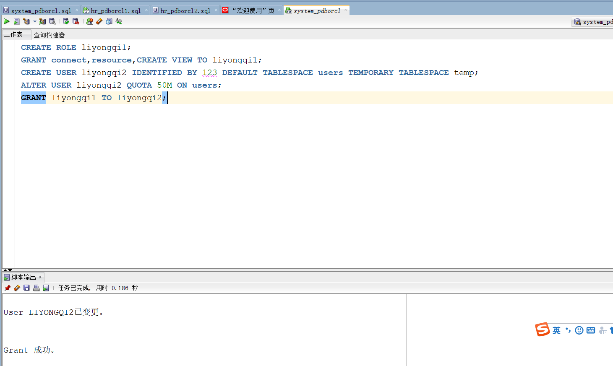
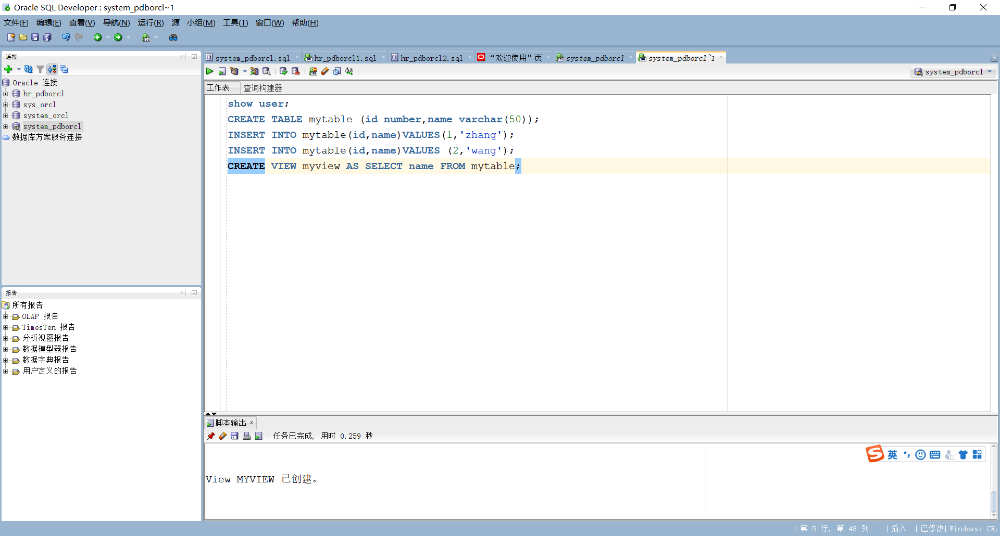

- 第1步：以system登录到pdborcl，创建角色liyongqi1和用户liyongqi2，并授权和分配空间：

语句“ALTER USER liyongqi2 QUOTA 50M ON users;”是指授权liyongqi2用户访问users表空间，空间限额是50M。

```
CREATE ROLE liyongqi1;
GRANT connect,resource,CREATE VIEW TO liyongqi1;
CREATE USER liyongqi2 IDENTIFIED BY 123 DEFAULT TABLESPACE users TEMPORARY TABLESPACE temp;
ALTER USER liyongqi2 QUOTA 50M ON users;
GRANT liyongqi1 TO liyongqi2;
```



- 第2步：新用户liyongqi2连接到pdborcl，创建表mytable和视图myview，插入数据，最后将myview的SELECT对象权限授予hr用户。

  

我们首先使用show user语句，我们可以发现确实是liyongqi2用户，然后继续其他操作。



接下来创建表格mytable，并且添加数据到mytable，然后创建视图myview，并且把mytable中的name作为myview的数据。


然后使用SELECT * FROM myview;查看myview数据可以看到数据，

```
NAME
--------------------------------------------------
zhang
wang
```


使用GRANT SELECT ON myview TO hr;语句，将myview的SELECT对象权限授予hr用户

- 第3步：用户hr连接到pdborcl，查询liyongqi2授予它的视图myview

  

可以发现使用hr用户查询到myview

## 查看数据库的使用情况


- autoextensible是显示表空间中的数据文件是否自动增加。
- MAX_MB是指数据文件的最大容量。