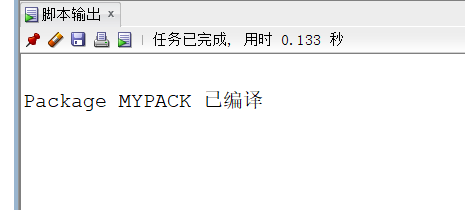
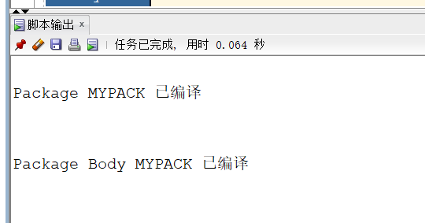
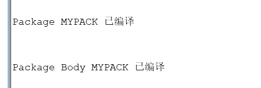
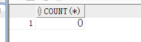
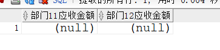

- # 实验5：PL/SQL编程

  ## 实验目的：

  ```
  了解PL/SQL语言结构
  了解PL/SQL变量和常量的声明和使用方法
  学习条件语句的使用方法
  学习分支语句的使用方法
  学习循环语句的使用方法
  学习常用的PL/SQL函数
  学习包，过程，函数的用法。
  ```

  ## 实验场景：

  - 假设有一个生产某个产品的单位，单位接受网上订单进行产品的销售。通过实验模拟这个单位的部分信息：员工表，部门表，订单表，订单详单表。
  - 本实验以实验四为基础

  ## 实验内容：

  1.创建一个包(Package)，包名是MyPack。

  ```
  create or replace PACKAGE MyPack IS
    FUNCTION Get_SaleAmount(V_DEPARTMENT_ID NUMBER) RETURN NUMBER;
    PROCEDURE Get_Employees(V_EMPLOYEE_ID NUMBER);
  END MyPack;
  ```

  

  2.在MyPack中创建一个函数SaleAmount ，查询部门表，统计每个部门的销售总金额，每个部门的销售额是由该部门的员工(ORDERS.EMPLOYEE_ID)完成的销售额之和。函数SaleAmount要求输入的参数是部门号，输出部门的销售金额。

  ```
  create or replace PACKAGE BODY MyPack IS
    FUNCTION Get_SaleAmount(V_DEPARTMENT_ID NUMBER) RETURN NUMBER
    AS
      N NUMBER(20,2); 
      BEGIN
        SELECT SUM(O.TRADE_RECEIVABLE) into N FROM ORDERS O,EMPLOYEES E
        WHERE O.EMPLOYEE_ID=E.EMPLOYEE_ID AND E.DEPARTMENT_ID =V_DEPARTMENT_ID;
        RETURN N;
      END;
  
  	PROCEDURE GET_EMPLOYEES(V_EMPLOYEE_ID NUMBER)
    AS
      LEFTSPACE VARCHAR(2000);
      begin
        LEFTSPACE:=' ';
        DBMS_OUTPUT.PUT_LINE('ID  姓名');
        DBMS_OUTPUT.PUT_LINE('=======================');
        for v in
        (SELECT LEVEL,EMPLOYEE_ID,NAME,MANAGER_ID FROM employees
        START WITH EMPLOYEE_ID = V_EMPLOYEE_ID
        CONNECT BY PRIOR EMPLOYEE_ID = MANAGER_ID)
        LOOP
          DBMS_OUTPUT.PUT_LINE(LPAD(LEFTSPACE,(V.LEVEL-1)*4)||
                               V.EMPLOYEE_ID||' '||v.NAME);
        END LOOP;
      END;
  END MyPack;
  ```

  

  3.在MyPack中创建一个过程，在过程中使用游标，递归查询某个员工及其所有下属，子下属员工。过程的输入参数是员工号，输出员工的ID,姓名，销售总金额。信息用dbms_output包中的put或者put_line函数。输出的员工信息用左添加空格的多少表示员工的层次（LEVEL）。比如下面显示5个员工的信息：

  存储过程创建

  ```
  create or replace PACKAGE MyPack IS
    procedure get_xiaoshou(V_EMPLOYEE_ID NUMBER);
  END MyPack;
  /
  
  create or replace PACKAGE BODY MyPack IS
      PROCEDURE get_xiaoshou(V_EMPLOYEE_ID NUMBER)
    AS
      begin
        LEFTSPACE:=' ';
        DBMS_OUTPUT.PUT_LINE('ID  姓名  销售总金额');
        DBMS_OUTPUT.PUT_LINE('=======================');
        DECLARE cursor cur_info is
      	    select level,R.* from 
      (select E.employee_id,E.name,E.manager_id,lb.total from employees E left join
      (select employee_id, sum(trade_receivable) as total from orders
          group by employee_id) lb
      on E.employee_id = lb.employee_id) R
      start with employee_id = 1 connect by prior employee_id = manager_id;
      	v_info cur_info%ROWTYPE;
          
          begin open cur_info;
      	loop
      	fetch cur_info into v_info;
      	exit when cur_info %notfound;
      	dbms_output.put_line(LPAD(' ',(v_info.level-1)*4)||v_info.employee_id||' '||v_info.name||' '||v_info.total);
      	end loop;
      	close cur_info;
          end;
      end;
  END MyPack;
  /
  set serveroutput on;
  DECLARE
    V_EMPLOYEE_ID NUMBER;    
  BEGIN
    V_EMPLOYEE_ID := 1;
    MYPACK.get_xiaoshou (V_EMPLOYEE_ID => V_EMPLOYEE_ID) ;   
  END;
  ```

  

  4.测试

  函数Get_SaleAmount()测试方法：

  select count(*) from orders;
  select MyPack.Get_SaleAmount(11) AS 部门11应收金额,MyPack.Get_SaleAmount(12) AS 部门12应收金额 from dual;

  

  

  过程Get_Employees()测试代码：

  set serveroutput on
  DECLARE
    V_EMPLOYEE_ID NUMBER;    
  BEGIN
    V_EMPLOYEE_ID := 1;
    MYPACK.Get_Employees (  V_EMPLOYEE_ID => V_EMPLOYEE_ID) ;  
    V_EMPLOYEE_ID := 11;
    MYPACK.Get_Employees (  V_EMPLOYEE_ID => V_EMPLOYEE_ID) ;    
  END;

  

  ## 实验总结

   本次实验我们学习了PL/SQL语言的编写，本质上oracle的PL/SQL与mysql的存储过程和存储函数，以及两者之间游标的使用都有很大的相识程度，PL/SQL是一种面向过程的类似Pascal的语言，是Oracle公司对SQL语言的功能的扩展，它是将过程性结构与oracle SQL无缝的集成在一起而产生的一种结构化的强有力的语言，是一种高级数据库程序设计语言。通过本次试验，我对PL/SQL编程思想有了进一步的了解，通过动手实现PL/SQL编程，更加深刻的理解了PL/SQL编程的特点。在实验中了掌握PL/SQL块结构、PL/SQL的基本语法、PL/SQL的控制结构。掌握PL/SQL块中使用复合数据类型和游标的方法。学习到了PL/SQL异常处理技术。